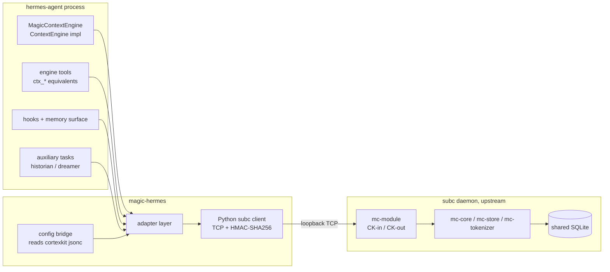

# Hermes Magic Context Connector - Plan

> **Implementation correction (2026-08-18).** Inspection of the installed official
> `@cortexkit/pi-magic-context` 0.38.x package showed that the supported Pi and
> OpenCode path is the packaged JavaScript runtime plus the shared SQLite store,
> not the proposed subc daemon contract. The implementation therefore uses a
> private local-stdio Node adapter and upstream functions directly. The product
> outcomes and “connector, not reimplementation” rule below remain authoritative;
> daemon-specific R1/KTD1/U1/U2 mechanics and their fake-daemon tests are
> superseded by the runtime integration gate documented in `README.md` and
> `docs/PARITY.md`. This file is retained as the historical planning record.

Product Contract unchanged from the 2026-08-17 brainstorm (scope, actors,
success criteria carried verbatim; Requirements below assign stable R-IDs to
the already-stated scope).

## Goal Capsule

**Objective:** Give hermes-agent feature parity with the Magic Context
pi/opencode plugins via a connector plugin (`magic-hermes`) that reuses the
upstream magic-context monorepo's logic and daemon, adding only a Python
client + hermes adapter.

**Product authority:** User directive (2026-08-17 session): "feature parity…
use existing hermes integration surfaces", "create a new repo… call it
magic-hermes", "re-use as much as possible from upstream magic-context github
repo". Scoping gate (same session): core-path first, historian/dreamer
hermes-native, tests = fake-daemon units + live-daemon integration gate.

**Open blockers:** None. Former planning questions resolved: historian/dreamer
run hermes-native (user-confirmed); subc protocol reference is the TS client
source; gateway routing is verified in U7.

## Product Contract

### Actors

- **Primary:** hermes-agent sessions (CLI, gateway/api_server, cron) on a
  machine where the subc daemon and Magic Context are already installed.
- **Secondary:** the developer maintaining magic-hermes alongside the
  upstream monorepo plugins.

### Problem

Magic Context exists only as TypeScript plugins for pi and OpenCode.
Hermes-agent (Python) sessions get none of its benefits: no compartmented
history, no background compaction, no cross-session recall, no persistent
project memory.

### Outcome

A hermes plugin that delivers the same effective behavior as the pi/opencode
plugins: compartmented `<session-history>`, historian-driven compaction,
cross-session search/expand/reduce tools, persistent memories, and notes —
all backed by the same daemon, store, and config the other harnesses share
on the machine.

### Requirements

*Connector and protocol*

- R1. Python subc client (loopback TCP, HMAC-SHA256, byte-compatible wire
  with TS/Rust consumers), ported from the upstream TS client source as the
  protocol reference.
- R2. All Magic Context logic (transform, decay, store, tokenizer, prompts)
  stays in the upstream daemon; magic-hermes contains no reimplemented
  logic.

*Hermes surfaces*

- R3. Compaction runs through hermes' `ContextEngine` surface
  (`register_context_engine`), replacing only the built-in compressor.
- R4. Recall/tools (`ctx_search`/`ctx_expand`/`ctx_reduce`/`ctx_note`/
  `ctx_memory` equivalents) are exposed via hermes' engine tool hooks.
- R5. Persistent memories integrate with hermes' standard memory config
  surface; notes surface at natural work boundaries.

*Shared substrate and config*

- R6. Engine settings are single-sourced from the shared cortexkit config;
  hermes-native config holds only hermes-facing toggles (enable/disable,
  engine selection).

*Quality*

- R7. `docs/PARITY.md` documents every observable divergence from
  pi/opencode.
- R8. When the daemon is unreachable, hermes sessions degrade gracefully
  (fail-closed: messages pass through unchanged, plugin never breaks a
  turn).

### Scope — in

- Python subc client (loopback TCP, HMAC-SHA256, byte-compatible wire with
  TS/Rust consumers).
- Hermes adapter over native surfaces: `register_context_engine`,
  `register_tool`, hermes memory config surface, `register_hook` /
  `register_middleware`, `register_auxiliary_task`.
- Reading the shared `~/.config/cortexkit/magic-context.jsonc` for engine
  settings (historian model, embeddings); hermes-native config only for
  hermes-facing toggles.
- PARITY.md documenting deliberate hermes↔pi↔opencode divergences.
- Plugin installable into `~/.hermes/plugins/` (or hermes plugin install
  path) from this repo.

### Scope — out

- Any reimplementation of Magic Context logic in Python (transform, decay,
  store, tokenizer, dreamer/historian prompts stay upstream).
- Changes to the upstream monorepo beyond what a later upstreaming PR would
  carry (e.g., a `packages/cli` hermes adapter is future work, optional).
- Dashboard, CLI wizard, e2e harness integrations (follow only if parity
  requires them).

### Success criteria

1. A hermes session with the plugin active shows compartmented history and
   survives long conversations without context-wall failures, matching the
   pi plugin's effective behavior.
2. `ctx_*`-equivalent tools registered in hermes resolve against the same
   store a pi/opencode session on the machine reads — cross-harness recall.
3. Compaction runs through hermes' context-engine surface, not a parallel
   pipeline; hermes' built-in compressor is the only thing replaced.
4. Config is single-source: changing the historian model in the shared
   cortexkit config changes hermes behavior without editing hermes config.
5. PARITY.md explains every observable divergence from pi/opencode.

### Assumptions

- The subc daemon and its HMAC handshake are stable enough to implement
  against byte-for-byte; the TS client source is the protocol reference.
- hermes `ContextEngine` contract (`agent.context_engine.ContextEngine`,
  single registered engine) is the correct sole compaction surface.
- hermes plugin API (`hermes_cli/plugins.py`) is stable for the surfaces
  listed; no hermes-agent fork required.

---

## Planning Contract

### Key Technical Decisions

- **KTD1 — Daemon-only architecture.** The Python plugin never embeds
  Magic Context logic; it speaks the subc protocol to the shared daemon
  hosting `mc-module`. Rationale: the user's core constraint; the in-process
  TS core is unreachable from Python anyway. Consequence: the plugin is
  only functional when the daemon is running — hence R8's fail-closed rule.
- **KTD2 — Protocol port with byte-level parity tests.** The wire protocol
  is ported from `@cortexkit/subc-client` TS source, validated against
  scripted fake-daemon fixtures captured from real frames. Round-trip
  latency budget is generous: upstream measured 0.28–0.38 ms p50
  loopback round-trips, so Python overhead up to ~10 ms per call is
  acceptable and still far below compaction pass cost (~280 ms).
- **KTD3 — One context engine, registered via plugin.** `context.engine:
  "magic_context"` in hermes `config.yaml` selects the plugin's engine;
  hermes enforces single-engine, so no coexistence mode. Engine tools ship
  through `ContextEngine.get_tool_schemas`/`handle_tool_call` (the
  contract's native tool path) rather than parallel `register_tool`
  registrations, keeping lifecycle owned by the engine.
- **KTD4 — Historian/dreamer hermes-native.** Background historian and
  dreamer runs use hermes' own runtime (`register_auxiliary_task`),
  mirroring pi-plugin's historian-runner pattern. No `pi --print`-style
  subprocess spawning (user-confirmed at scoping gate).
- **KTD5 — Config bridging is read-only.** The plugin reads the shared
  cortexkit jsonc; it never writes it. Hermes-facing toggles live in
  hermes `config.yaml` under the plugin's namespace.
- **KTD6 — Core path first.** Units are phased: protocol → engine → tools →
  memory → background agents → parity breadth. Each phase is independently
  shippable; the parity-breadth phase (U7) can land incrementally.

### High-Level Technical Design

Component topology:

Compaction turn sequence: hermes run loop → `update_from_response(usage)` →
`should_compress_info()` returns true at threshold → `compress(messages…)`
→ adapter serializes messages to the daemon route → `mc-core` transform
returns compartment summary + new message list → engine returns valid
OpenAI-format messages (unchanged on any daemon error) → token state fields
updated for the status display.

### Implementation constraints

- Python 3.11+ (hermes-agent baseline); stdlib-only networking (`socket`,
  `hmac`, `hashlib`) for the client — no asyncio dependency inside the
  engine path (hermes calls `compress` synchronously).
- TCP_NODELAY on the client socket, matching the TS client.
- No writes to the shared SQLite or cortexkit config from the plugin.
- Late-import hermes modules inside plugin load, never at module import
  time (keeps the repo testable without hermes installed).

### Sources / Research

- Upstream monorepo clone at `~/.pi/agent/npm/node_modules/…` siblings;
  layout: `crates/` (mc-core, mc-store, mc-tokenizer, mc-module under the
  subc daemon), `packages/plugin` (shared opencode/pi core),
  `packages/pi-plugin` (harness adapter, PARITY.md precedent).
- Transport characteristics: upstream
  `docs/rust-mode-transport-overhead-2026-08-10.md` (round-trip p50
  0.28–0.38 ms; connect/auth ~6.7 ms; route open ~1.6 ms).
- hermes `ContextEngine` contract: hermes-agent
  `agent/context_engine.py` (abstract methods, lifecycle, tool hooks,
  fail-safe defaults for optional hooks).
- hermes plugin API: hermes-agent `hermes_cli/plugins.py`
  (`register_context_engine`, `register_tool`, `register_hook`,
  `register_middleware`, `register_auxiliary_task`, …).
- subc protocol reference: `@cortexkit/subc-client` installed package
  source (TS), README documents wire compatibility with Rust consumers.

---

## Implementation Units

### U1. Python subc wire client

**Goal:** Standalone, stdlib-only client speaking the subc loopback-TCP
wire protocol byte-compatibly (frame header, HMAC-SHA256 handshake, route
open/request/close, request/response correlation).

**Requirements:** R1, R2.

**Dependencies:** none.

**Files:** `src/magic_hermes/subc/__init__.py`,
`src/magic_hermes/subc/transport.py`, `src/magic_hermes/subc/client.py`,
`tests/subc/test_transport.py`, `tests/subc/test_client.py`,
`tests/subc/fake_daemon.py`.

**Approach:** Port from the TS `@cortexkit/subc-client` source; keep frame
construction and handshake ordering byte-identical. Long-lived connection
with lazy reconnect; TCP_NODELAY; explicit request timeout.

**Patterns to follow:** TS client's connect/auth/route sequence as
documented in the upstream transport-overhead report.

**Test scenarios:**
- Happy path: handshake → health round-trip against the scripted fake
  daemon; assert byte-identical frames where fixtures captured them.
- Frame boundaries: 1 KiB / 8 KiB / 32 KiB payloads round-trip without
  truncation (the 8 KiB write-boundary case from the upstream report).
- Error paths: daemon closes mid-handshake; bad HMAC rejected; request
  timeout yields a typed exception, not a hang.
- Reconnect: after a dropped connection, the next request transparently
  re-establishes (connect + auth + route reopen).

**Verification:** pytest suite green with the fake daemon; no hermes
imports anywhere in `subc/`.

### U2. Session client + config bridge

**Goal:** Daemon discovery, module route management, request/response
typing for the mc-module CK-in/CK-out contract, and read-only loading of
the shared cortexkit config.

**Requirements:** R1, R2, R6.

**Dependencies:** U1.

**Files:** `src/magic_hermes/session.py`,
`src/magic_hermes/config.py`, `tests/test_session.py`,
`tests/test_config.py`.

**Approach:** Discover daemon endpoint the same way the TS plugins do
(shared cortexkit state dir); cache the route; expose typed call helpers
for the transforms the adapter needs. Config loader parses the shared
jsonc into frozen dataclasses; missing file → documented defaults + a
logged warning, never an exception.

**Test scenarios:**
- Happy path: discovery finds the endpoint; typed round-trip against the
  fake daemon's mc-module route.
- Config: shared jsonc parsed (historian model, embeddings); commented and
  missing keys fall back to defaults; file absent → defaults.
- Edge: malformed jsonc → defaults + warning, session continues.

**Verification:** pytest green; loading real
`~/.config/cortexkit/magic-context.jsonc` in an integration test returns
the same historian model pi/opencode see.

### U3. Hermes context engine adapter

**Goal:** `MagicContextEngine(ContextEngine)` wired via
`register_context_engine`, implementing the full hermes contract:
token state, `update_from_response`, `should_compress_info`, `compress`,
session lifecycle hooks, `get_status`.

**Requirements:** R3, R6, R8.

**Dependencies:** U2.

**Files:** `src/magic_hermes/engine.py`,
`src/magic_hermes/plugin.py`, `tests/test_engine.py`.

**Approach:** `compress` sends the message list to the daemon transform
route and returns the resulting OpenAI-format list. Fail-closed: on any
client error return the input messages unchanged and record the failure in
`get_status`. Suppress routine automatic-compaction status
(`emit_automatic_compaction_status = False`) since passes are background
maintenance — surface warnings/errors only. Selection via
`context.engine: "magic_context"` in hermes config.

**Patterns to follow:** hermes `ContextEngine` docstring lifecycle; the
built-in compressor's threshold semantics (`threshold_percent`,
`protect_first_n`/`protect_last_n` defaults pass through to the daemon
budget parameters).

**Test scenarios:**
- Happy path: over-threshold usage → `should_compress_info` true →
  `compress` returns the daemon's shortened list; token counters update.
- Fail-closed: daemon down → `compress` returns input unchanged; status
  reports degraded; no exception escapes to the run loop.
- Edge: empty/short message lists never trigger a daemon call; `force`
  bypasses cooldown state.
- Integration: engine + fake daemon end-to-end — usage-driven compaction
  fires exactly once at threshold, not repeatedly (anti-thrash).

**Verification:** pytest green; manual hermes session with
`context.engine: "magic_context"` compacts a long conversation and shows
compartmented history.

### U4. Recall and context tools

**Goal:** `ctx_search` / `ctx_expand` / `ctx_reduce` / `ctx_note` /
`ctx_memory` equivalents exposed through the engine's tool hooks, resolving
against the shared store.

**Requirements:** R4, R2.

**Dependencies:** U3.

**Files:** `src/magic_hermes/tools.py`, `tests/test_tools.py`.

**Approach:** Implement via `get_tool_schemas`/`handle_tool_call` on the
engine (single lifecycle owner). Tool results are plain hermes-format tool
outputs; IDs in results use the store's ordinals so expand-by-ordinal
works cross-harness.

**Test scenarios:**
- Happy path: each tool round-trips against the fake daemon with realistic
  payloads; `ctx_search`-equivalent returns ranked results with ordinals;
  `ctx_expand`-equivalent recovers the surrounding exchange.
- Error paths: unknown ordinal → typed error message; daemon down →
  degraded notice, not an exception.
- Cross-harness: integration test writes a session via the real daemon,
  reads it back through the tool (covered by the live gate, U8).

**Verification:** pytest green; in a live hermes session the tools appear
and return results from sessions recorded by pi/opencode.

### U5. Memory and notes integration

**Goal:** Persistent memories through hermes' standard memory config
surface; session notes that surface at natural work boundaries.

**Requirements:** R5, R6.

**Dependencies:** U3.

**Files:** `src/magic_hermes/memory.py`, `tests/test_memory.py`.

**Approach:** Map the store's memory records onto hermes' memory provider
surface (standard config keys in hermes `config.yaml`); read/write through
the daemon. Notes read at session start / compaction boundaries via the
engine's lifecycle hooks.

**Test scenarios:**
- Happy path: memory write via the hermes surface is visible to a
  `ctx_memory`-equivalent read; note write surfaces on next session start.
- Edge: memory disabled in hermes config → tools still work, memory
  surface dormant; empty store → clean no-op.

**Verification:** pytest green; live: a memory written in hermes appears
in pi's `<project-memory>` on the next pi session.

### U6. Historian and dreamer, hermes-native

**Goal:** Background historian and dreamer runs as hermes auxiliary tasks,
mirroring pi-plugin's historian-runner/publish-signal behavior.

**Requirements:** R3 (lifecycle ownership), KTD4.

**Dependencies:** U3, U5.

**Files:** `src/magic_hermes/auxiliary.py`, `tests/test_auxiliary.py`.

**Approach:** Register auxiliary tasks that drain compaction signals,
publish historian results back through the store, and schedule dreamer
passes. Model selection comes from the shared config (historian model
key). Failure of a background pass never blocks a foreground turn.

**Test scenarios:**
- Happy path: compaction signal → auxiliary historian task drains and
  publishes; dreamer schedules on its cadence.
- Error paths: historian model call fails → retry with backoff, signal
  retained; daemon down → tasks idle, not crash-loop.
- Edge: session ends mid-pass → next session's startup rehydration
  recovers (pi-plugin's startup-rehydration pattern).

**Verification:** pytest green; live: a hermes conversation compartmented
at hour N has searchable historian summaries at hour N+1.

### U7. Parity breadth + PARITY.md

**Goal:** Close the remaining observable gaps against the pi plugin
(auto-search, compartment injection on session start, protected-tail
handling, temporal markers, status display, todo capture), and document
every remaining divergence in `docs/PARITY.md`.

**Requirements:** R7; Success criterion 1 and 5.

**Dependencies:** U3, U4, U5.

**Files:** `src/magic_hermes/parity/` (one module per feature),
`tests/parity/`, `docs/PARITY.md`.

**Approach:** Port each pi-plugin feature's observable behavior, not its
code; each lands as an independently shippable increment. PARITY.md rows:
feature / pi behavior / hermes behavior / divergence reason. Items that
cannot reach parity on hermes surfaces are documented, not approximated.

**Test scenarios:**
- Per feature: behavior test against the fake daemon (e.g. auto-search
  injects results when the user's message looks like recall intent).
- Parity audit: a checklist test walks PARITY.md rows asserting each maps
  to a shipped module or an explicit documented divergence.

**Verification:** pytest green; PARITY.md reviewed against
`packages/pi-plugin` feature inventory with no unexplained gaps.

### U8. Packaging, install, and live integration gate

**Goal:** Installable plugin, live-daemon integration suite, and
end-to-end verification of the cross-harness success criteria.

**Requirements:** R1–R8; all success criteria.

**Dependencies:** U3, U4, U5, U6 (U7 optional for first release).

**Files:** `pyproject.toml`, `tests/integration/test_live_daemon.py`,
`README.md`.

**Approach:** Install into hermes' plugin path; integration suite auto-
skips when the daemon is absent and is a hard gate when present. The
README quickstart covers: daemon running, shared config present, hermes
`context.engine: "magic_context"`, verify with a status command.

**Test scenarios:**
- Live: hermes engine compacts through the real daemon; tools recall a
  session written by another harness; config change (historian model)
  takes effect without hermes config edits.
- Packaging: fresh-environment install passes `python -c "import
  magic_hermes"` without hermes present (late-import rule).

**Verification:** all success criteria demonstrated live on this machine;
integration suite green with daemon up, cleanly skipped with daemon down.

---

## Verification Contract

- Unit gates: `pytest tests/ -q` green; `ruff check src tests` clean
  (add ruff config to pyproject).
- Integration gate: `pytest tests/integration -q` against the live subc
  daemon; auto-skip (reported, not silent) when the daemon is down.
- No test in this repo may require hermes-agent to be importable, except
  the optional live suite.
- Cross-harness proof is part of the U8 gate, not optional polish.

## Definition of Done

- All units' test scenarios pass and their verification steps executed.
- No logic duplicated from upstream: grep-level audit shows no transform/
  decay/tokenizer/prompt code in `src/` beyond serialization glue.
- Fail-closed behavior proven: hermes sessions complete normally with the
  daemon stopped.
- `docs/PARITY.md` has a row for every pi-plugin feature inventory item.
- Dead-end experimental code from earlier unit attempts is removed from
  the tree before the final commit.
- README quickstart reproducible on this machine from a clean plugin
  install.

## Open Questions

1. Distribution beyond this repo (plugin registry / upstream monorepo
   sibling) — deferred, non-blocking; local install satisfies all success
   criteria.
2. Gateway (api_server) session routing through the context-engine path —
   resolved by U3/U8 verification; if gateway sessions bypass the engine,
   record the divergence in PARITY.md rather than widening scope.
